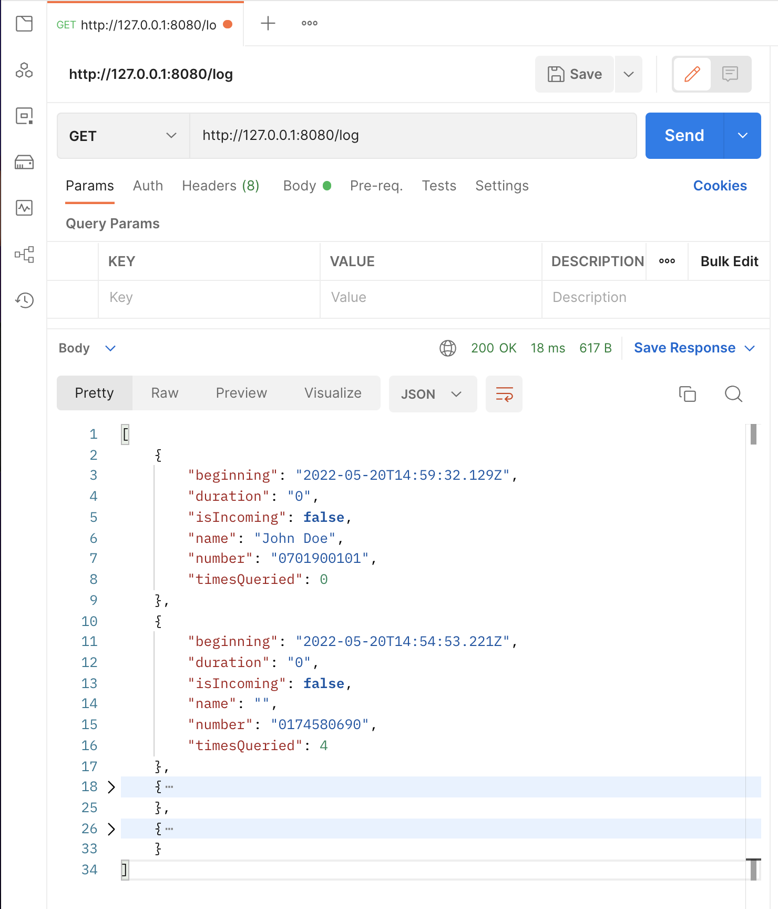

### Call Monitor Task

This is an application that runs in the background and serves call data to clients on the same network.

The Project includes an Http Server, which is reachable by other clients on the same wifi network as the device running the App.

Upon launch, the client app binds to the `CallMonitor` service and displays the device's IpAddress and the server's port. This information can be used to make http requests to the server to get the status of the service and the list of calls logged. The client will also display a list of calls logged since the service started running on the device.

In order to run the App, if running on an emulator, please ensure that you enable port forwarding if you want to access the API on a client machine. An example below forward the emulator's port 8080 traffic to the local machine's port 8080;
```text
❯ adb forward tcp:8080 tcp:8080
```

### Modules
The project is comprised of two modules namely: app and call-monitor-server.

* **Call Monitor Server** <br/>
This module contains all the necessary business logic to detect and log incoming and outgoing phone calls. It also defines the `CallMonitorHttpService` which runs in the background.
The service is started at boot time and also can be started by binding to an application component such as an activity.
This module exposes a public API `CallMonitorApi` which clients can use to get call log data.

* **Call Monitor App**
This module defines the client app that consumes the call logs served by the call monitor server. The logic in the client app has been deliberately kept at a minimum to ensure that any app that includes the `call-monitor-server` as a dependency can access all the necessary call logging functionality. This means that the server module is easily implementable by any client app of choice if one wishes to build it as a library or as a sub-module.


NB: The `CallMonitorHttpService` is both a started and bound service. It is the responsibility of the client apps to request for the neccessary permissions required by the `Call Monitor Server`.

### API
* The root route:`@GET /`

    This returns the service's availablity meta data and the routes supported by the service.

    The `"start"` field displays the date when the service started collecting call logs on the device.

  ```shell
  curl http://127.0.0.1:8080/
  ```

  ```json
  {
      "services": [
          {
              "name": "status",
              "uri": "http://10.0.2.16:8080/status"
          },
          {
              "name": "log",
              "uri": "http://10.0.2.16:8080/log"
          }
      ],
      "start": "2022-05-20T11:10:42.576Z"
  }
  ```

* The status route `@GET /status`

    This route returns the status of an ongoing call. In case there is no ongoing call, it returns a message; "No data".
    
    It returns the phone number of an ongoing call, the name of the person the device is in a call with and the ongoing status flag.

    ```shell
    curl http://127.0.0.1:8080/status
    ```

    ```json
    {
        "name": "John Doe",
        "number": "0701600601",
        "ongoing": true
    }
    ```
    If no call is in progress
    ```json
    {
        "message": "No data"
    }
    ```

* The log route: `@GET /log`

    This route returns a list of previous calls from the time of launch/start of the service. The `timesQueried` field in the results indicates how many times data on was requested while the cal was ongoing.

    The `isIcoming` flag denotes if the call is an incoming call or outgoing call. It is false for outgoing calls.

    ```shell
    curl http://127.0.0.1:8080/status
    ```

    ```json
    [
      {
          "beginning": "2022-05-20T15:02:39.143Z",
          "duration": "0",
          "isIncoming": false,
          "name": "John Doe",
          "number": "0701900101",
          "timesQueried": 1
      },
      {
          "beginning": "2022-05-20T14:59:32.129Z",
          "duration": "0",
          "isIncoming": false,
          "name": "John Doe",
          "number": "0701900101",
          "timesQueried": 0
      }
    ]
    ```

#### Screenshots

| Root | Ongoing |
| --- | --- |
|  |  |
| Log | App |
|  |  |
